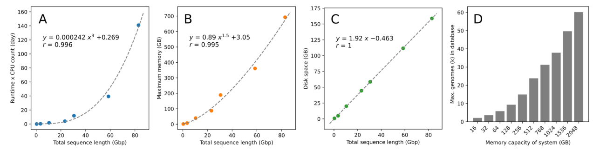

# Sequence alignment

Woltka takes sequence alignment files as input and generate feature tables. This means that you need to prepare alignments BEFORE running Woltka. The way you want your sequences to be aligned is highly flexible, and can be customized according to your research goals. This page provides general guidelines and detailed examples.

## Contents

- [Sequence data](#sequence-data)
- [Reference database](#reference-database)
- [Alignment with Bowtie2](#alignment-with-bowtie2)
- [Other alignment tools](#other-alignment-tools)
  - [SHOGUN](#the-shogun-protocol), [Minimap2](#minimap2), [BWA](#bwa), [BURST](#burst), [BLASTn](#blastn)

## Sequence data

This will be your sequence data generated from microbiome samples. They can be DNA (metagenome), RNA (metatranscriptome), or other types of data. They are usually in the file format of FastQ or Fasta, but other formats may also apply.

- **Note**: Woltka is designed for whole-(meta)genome shotgun sequencing data. Technically, you can analyze 16S rRNA data using Woltka, but I don't see the rationale. Please instead learn about [QIIME 2](https://docs.qiime2.org/).

Proper quality control should be performed prior to sequence alignment. Here is an [introduction](https://www.metagenomics.wiki/tools/short-read/quality-control). Also see our latest benchmarks: [Armstrong et al. (2022)](https://journals.asm.org/doi/full/10.1128/msystems.01378-21).

## Reference database

The sequence data should be aligned to a reference database. It can be a database of **reference genomes**. Or, it can be a database of reference genes (nucleotides or proteins). The latter scenario is less typical for Woltka, but it works.

Our [WoL](wol.md) database can be downloaded from this [Dropbox site](https://www.dropbox.com/sh/rwhetdmwomi9k34/AAAKRLIJ2nFniJESgb8lHR-na?dl=0). `wolr1_seqs` is the genome sequences (recommended). `wolr1_orfs` is the re-annotated ORF sequences (amino acids). This database is generally useful for microbiome studies.

We have also tested multiple other databases, including [GEBA-I](https://genome.jgi.doe.gov/portal/geba1003/geba1003.info.html), [UHGG](https://www.ebi.ac.uk/metagenomics/genome-catalogues/human-gut-v2-0), [MIDAS](https://github.com/snayfach/MIDAS), [GTDB](https://gtdb.ecogenomic.org/) (we have a dedicated [tutorial](gtdb.md) for GTDB), and [GEM](https://genome.jgi.doe.gov/portal/GEMs/GEMs.home.html). The results were reported in [Zhu et al. (2022)](https://journals.asm.org/doi/10.1128/msystems.00167-22).

In summary, Woltka works with any database. The choice of database should depend on your research scope, and technical feasibility.

## Alignment with Bowtie2

Woltka has been most extensively tested and validated on sequence alignments generated by [**Bowtie2**](http://bowtie-bio.sourceforge.net/bowtie2/index.shtml) ([Langmead and Salzberg, 2012](https://www.nature.com/articles/nmeth.1923)), an ultrafast short sequence aligner that has been widely adopted in many applications.

### Database indexing

Let's say your reference genome sequences are in a Fasta-formatted file `db.fna`. Before running Bowtie2 alignment, you need to index the reference genome database (8 is the number of CPU cores you plan to allocate, same below):

```bash
bowtie2-build --threads 8 db.fna db
```

This takes quite a while, and it could cost a substantial amount of memory, especially for large databases (many reference genomes). So do it on a supercomputer. The good news is that you just need to do it once.

For example, our [WoL](wol.md) database, which has 10,575 reference genomes, took nearly 9 hours to build and had a peak memory consumption of 190 GB. The indexed database costs 54.5 GB disk space.

Below is the benchmark we generated for your reference (disclaimer: we make no warranty to its accuracy).



### Sequence alignment

Then you can align your sequencing data against the database. Let's assume you have paired-end sequences in FastQ files `R1.fq` and `R2.fq` for each sample, or for the entire multiplexed dataset. The basic alignment command is as simple as:

```bash
bowtie2 -p 8 -x db -1 R1.fq -2 R2.fq -S output.sam
```

The output file `output.sam` is an alignment file in [SAM](https://en.wikipedia.org/wiki/SAM_(file_format)) format. This will be the [input](input.md) file for Woltka.

As a rule of thumb, the `--very-sensitive` flag is recommended, because we want to maximize discovery of diverse microbes in the sample (instead for pursuing accurate alignment to the human genome). 

Meanwhile, we can suppress SAM header (`--no-head`) and unaligned sequences (`--no-unal`) to reduce the size of output files. Woltka won't need these. But in case you need them for other applications, you may skip these flags.

So the command becomes (**recommended**):

```bash
bowtie2 -p 8 -x db -1 R1.fq -2 R2.fq -S output.sam --very-sensitive --no-head --no-unal
```

The alignment step is fast and it costs much less memory compared with the database indexing step. Below is our benchmark on the [HMP](https://www.hmpdacc.org/hmp/) metagenome dataset against our [WoL](wol.md) database (disclaimer: we make no warranty to its accuracy).

- From the benchmark we learned that Bowtie2 scales well with several CPU cores (8 is a good number). But it perhaps makes less sense to use more than 16 CPU cores for a single task.


It maybe worth checking out the [Bowtie2 manual](http://bowtie-bio.sourceforge.net/bowtie2/manual.shtml) and this [performing tuning guide](https://community.arm.com/developer/tools-software/hpc/b/hpc-blog/posts/tuning-bowtie2-better-performance) on how to optimize the Bowtie2 framework.

### The SHOGUN protocol

[SHOGUN](https://github.com/knights-lab/SHOGUN) ([Hillmann et al., 2018](https://journals.asm.org/doi/full/10.1128/mSystems.00069-18), [2020](https://academic.oup.com/bioinformatics/article/36/13/4088/5828930)) is a metagenomics package developed by our collaborators and us. It wraps up sequence aligners such as Bowtie2. The team did benchmarks and found that the following additional Bowtie2 parameters are suitable for the task of metagenomics. Our team also validated this in a separate work ([Zhu et al., 2022](https://journals.asm.org/doi/10.1128/msystems.00167-22)).

- In brief, this means that Bowtie2 will return up to 16 hits that have 95% or higher sequence identity with each query sequence. You may consider adding them to the command above.

```bash
-k 16 --np 1 --mp "1,1" --rdg "0,1" --rfg "0,1" --score-min "L,0,-0.05"
```

So the entire command becomes:

```bash
bowtie2 -p 8 -x db -1 R1.fq -2 R2.fq -S output.sam --very-sensitive --no-head --no-unal -k 16 --np 1 --mp "1,1" --rdg "0,1" --rfg "0,1" --score-min "L,0,-0.05"
```

This is equivalent to the SHOGUN command:

```bash
shogun align -d db -a bowtie2 -t 8 -p 0.95 -i input.fa -o .
```


## Other alignment tools

Woltka has no limitation on what alignment tool should be used. Beyond Bowtie2, it is totally okay to use whatever you have already been using, for consistency with other parts of your research project (which is important!). Below are a few tools which we have tested.


### Minimap2

[Minimap2](https://github.com/lh3/minimap2) ([Li, 2018](https://academic.oup.com/bioinformatics/article/34/18/3094/4994778)) is a rapid aligner for short and long DNA and mRNA sequences. The default setting is for long sequences (such as PacBio and Nanopore). To make it work the best with short reads (such as Illumina), you need to add the `-ax sr` parameter.

Database indexing:

```bash
minimap2 -ax sr db.fna -d db.mmi
```

Sequence alignment:

```bash
minimap2 -t 8 -ax sr db R1.fq R2.fq -o output.sam
```

### BWA

[BWA](https://github.com/lh3/bwa) ([Li and Durbin, 2009](https://academic.oup.com/bioinformatics/article/25/14/1754/225615)) (Burrows-Wheeler Aligner) is a classical short sequence aligner. It has been used many. Researchers of modern time may want to check out [Minimap2](https://github.com/lh3/minimap2) or [BWA-MEM2](https://github.com/bwa-mem2/bwa-mem2). Anyway, here is the usage:

Database indexing:

```bash
bwa index -p db db.fna
```

Sequence alignment:

```bash
bwa mem -t 8 db R1.fq R2.fq > output.sam
```

### BURST

[**BURST**](https://github.com/knights-lab/BURST) ([Al-Ghalith and Knights, 2020](https://www.biorxiv.org/content/10.1101/2020.09.08.287128v1)) is a fast and optimal sequence aligner that scales well with modern metagenomic datasets while enjoying high accuracy. It is **exhaustive**, as it guarantees to return the best hits from the entire database (unlike tools such as Bowtie2 which is heuristic). You may consider it as a BLASTn alternative. Not as fast as Bowtie2, though, but a good choice when alignment accuracy is the priority.

Database building (these are the parameters we tested):

```bash
burst -t 8 -r db.fna -o db.edx -a db.acx -d DNA 320 -i 0.95 -s 1500
```

Sequence alignment:

```bash
burst -t 8 -r db.edx -a db.acx -q input.fa -o output.b6o -sa -fr -i 0.95
```

The output file is in [BLAST](https://www.metagenomics.wiki/tools/blast/blastn-output-format-6) format.

### BLASTn

The old-school [**BLAST**](https://en.wikipedia.org/wiki/BLAST_(biotechnology)) algorithm ([Altschul et al., 1990](https://pubmed.ncbi.nlm.nih.gov/2231712/)) is still viable as long as your database / sequence data are of limited size. Despite being slower than modern algorithms, its alignment accuracy is probably the best.

Database building:

```bash
makeblastdb -in db.fa -dbtype nucl -out db -title db
```

Sequence alignment (parameters are for reference only):

```bash
blastn -num_threads 8 -db db -query input.fa -out output.b6o -outfmt 6 -evalue 1e-10 -max_target_seqs 25
```
