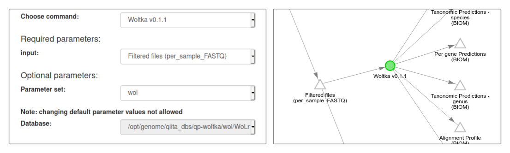

# Working with third-party tools and databases

## Contents

- Integrated platforms: QIIME 2, SHOGUN
- Web servers: [Qiita](#qiita)
- Sequence aligners: Bowtie2, BWA, Minimap2
- Sequence aligners: BLAST, VSEARCH
- Metagenomics profilers: Kraken/Bracken, Centrifuge, MetaPhlAn2, mOTUs2
- Genome databases: WoL, RefSeq, [GTDB](#gtdb)
- Taxonomic databases: NCBI, [GTDB](#gtdb)
- Functional databases: UniRef, GO, KEGG, BioCyc

Contents to be added. Some prelim documents are:

- https://github.com/biocore/wol/blob/master/start.md#information-for-users-of
- https://github.com/biocore/wol/blob/master/protocols/genome_database.md


## Qiita

The WoL database and the SHOGUN workflow are available at the [**Qiita**](https://qiita.ucsd.edu/) server. Users can analyze shotgun metagenomic data using WoL from the graphic user interface:

1. Start from host-filtered, adapter-trimmed per sample FASTQ files. Click "Process".
2. In "Choose command:", select "Shogun v1.0.7".
3. In "Parameter set:", select "wol_bowtie2" (or other combinations of aligner and database).
4. Click "Add Command" to kick-start the SHOGUN workflow.
5. When the job is completed, among the output files there is "Shogun Alignment Profile". It is a multiplexed, xzipped SAM format alignment file.
6. Click "alignment.bowtie2.sam.xz" to download this file.
7. You may now run Woltka by executing `woltka classify -i alignment.bowtie2.sam.xz ...`




## GTDB

[**GTDB**](https://gtdb.ecogenomic.org/) (Genome Taxonomy Database) ([Parks et al., 2018](https://www.nature.com/articles/nbt.4229)) is a phylogeny-based taxonomy system for bacteria and archaea.

The GTDB taxonomy is provided as Greengenes-style lineage strings, therefore can be directly parsed by Woltka (the file `gtdb_taxonomy.tsv` can be found in the GTDB-Tk [database](https://data.ace.uq.edu.au/public/gtdb/data/releases/release89/89.0/gtdbtk_r89_data.tar.gz)):

```bash
woltka classify --lineage gtdb_taxonomy.tsv --rank phylum,genus,species ...
```

[More details and various options of using GTDB](gtdb.md) are provided here.
