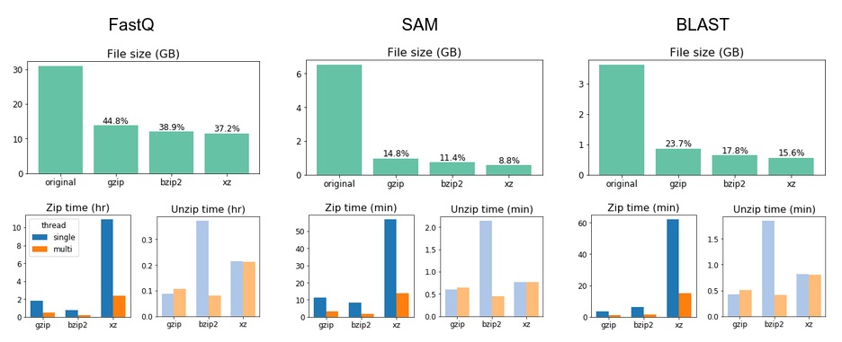

# Computational efficiency

Woltka is for handling very large alignment files and complex classification systems. Therefore computational expense is an important consideration. This page explains how much time Woltka spends on typical datasets and how much memory it needs, as well as multiple tips and tricks for improving performance.


## Contents

- [Runtime and memory estimates](#runtime-and-memory-estimates)
- [Benchmarks on a typical dataset](#benchmarks-on-a-typical-dataset)
- [Tips for efficient computing](#tips-for-efficient-computing)
  - [Tweak Woltka parameters](#tweak-woltka-parameters)
  - [Run separate jobs and merge results](#run-separate-jobs-and-merge-results)
  - [Split a large alignment file](#split-a-large-alignment-file)
  - [Compress alignment files](#compress-alignment-files)
  - [Keep external decompressors on](#keep-external-decompressors-on)
  - [Convert alignments to simple maps](#convert-alignments-to-simple-maps)
  - [Streamline alignment and classification](#streamline-alignment-and-classification)


## Runtime and memory estimates

Rules of thumb:

- Woltka's runtime is **linear** (_O_(_n_)) vs. the size of the input alignments, plus a small, constant overhead of reading the database.
- Woltka's memory consumption is determined by 1) the size of the reference database, and 2) the complexity of the microbiome communities (i.e., the size of the feature table). It is independent from the size of the input alignments.
- Woltka analyses are I/O-intensive. Performance of disk and memory matter.
- Woltka works the best with **two threads**: one for decompression and the other for classification.
- "Coord-match" functional analysis takes several folds more time than simple structural analysis.

For the Web of Life ([WoL](https://biocore.github.io/wol/)) database, which includes 10,575 genomes, the memory consumption is **<128 MB** for structural classification, and **<16 GB** for coordinates-based functional classification.

## Benchmarks on a typical dataset

**TL;DR**: It takes 10 min (structural analysis) or 1 hr ("coord-match" functional analysis) For every 10 GB gzipped SAM files.

In this example, we started with the [CAMI](https://data.cami-challenge.org/) high complexity toy dataset, which contains 5 samples with 15 Gbp HiSeq sequencing data each. We aligned them using the [Bowtie2](http://bowtie-bio.sourceforge.net/bowtie2/manual.shtml) following the [SHOGUN](align.md#the-shogun-protocol) protocol against the Web of Life ([WoL](wol.md)) database. This step generates up to 16 high-score alignments (matches) for each query sequence.

The five resulting alignment files (SAM format, gzipped) total **38.6 GB** in size. They include **1.05 billion** alignments (lines), with 501 million unique query sequences. They were stored in a hard disk drive (59,000 rpm, SATA 3). The test was performed on with a Xeon E3-1230 v3 CPU (Haswell microarchitecture) and 32 GB DDR3 memory. The software environment was Ubuntu 20.04 with Python 3.10.

Here are the benchmarks of multiple typical Woltka analyses:

Analysis | Runtime | Memory
--- | ---: | ---:
Just decompress; don't run Woltka | 21:48 | 1.824 MB
_Structural analysis_
Operational genomic unit ([OGU](ogu.md)) | 34:39 | 108.4 MB
Free-rank taxonomic classification | 40:07 | 115.1 MB
Classification at genus level | 35:49 | 113.4 MB
Classification at genus and export gzipped read maps | 51:59 | 113.0 MB
Classification at phylum, genus and species | 52.01 | 115.4 MB
_Functional analysis_
Simple read-gene matching | 4:08:53 | 7.745 GB
Simple read-gene matching, reporting RPK | 4:16:31 | 11.99 GB
Functional profiling at UniRef entry, then GO process | 4:24:49 | 14.92 GB
_Experimental_
Simple read-gene matching, with Numba [acceleration](install.md#acceleration) | 1:55:40 | 5.066 GB


## Tips for efficient computing

### Tweak Woltka parameters

Two Woltka parameters visibly impacts Woltka's speed:

- `--chunk` | Number of alignment lines to read and parse in each chunk. Default: one thousand for plain mapping, or one million for ordinal mapping.
- `--cache` | Number of recent classification results to cache for faster subsequent classifications. Default: 1024.

Their default values were set based on our experience. However, alternative values could improve (or reduce) performance depending on the computer hardware, input file type, and database capacity. if you plan to routinely process bulks of biological big data using the same setting, we recommend that you do a few test runs on a small dataset and find out the values that work the best for you.


### Run separate jobs and merge results

You may have hundreds of alignment files to crunch, and dozens of compute nodes to crunch with, and you realized that Woltka does not support parallel processing. However, the good news is that Woltka's output files -- profiles (feature tables) and read-to-feature maps, are merageable. Therefore, you may divide your input files into multiple subsets, run Woltka on each of them, and merge results in the end. The outcome will be identical to that of running Woltka once on all files.

Woltka provides a utility to conveniently merge multiple profiles:

```bash
woltka merge -i table1.biom -i table2.biom -i table3.biom ... -o merged.biom
```

Or:

```bash
woltka merge -i <directory containing lots of .biom/tsv> -o merged.biom/tsv
```

Note: If you plan to run Woltka on each individual file (not multiplexed), you should add `--no-demux` to the command, otherwise Woltka will attempted to demultiplex it. Example:

```bash
for i in *.sam; do
   echo "woltka -i $i -o ${i%.sam}.tsv --no-demux" | qsub
done
```

### Split a large alignment file

Today's alignment files can be huge, especially when they are multiplexed, containing hundreds of samples in a single file.

Woltka supports [automatic demultiplexing](input.md#demultiplexing), by the way. This also means that you can manually cut the alignment file into chunks, without explicitly demultiplexing it (i.e., you can cut in the middle of a sample, which is totally fine), run Woltka on each chunk (which will be demultiplexed individually), then merge results.

### Compress alignment files

The input files for Woltka -- sequence alignment files cost disk space, and compression can help. An advantage of Woltka is that it automatically detects and parses compressed files, including the three most common formats: **gzip**, **bzip2** and **xz** (i.e., LZMA) (see [details](input.md#file-formats)).

Below is a set of simple benchmarks performed on a typical shotgun metagenomics dataset, including the original FastQ sequence files and two alignment file formats.



It is evident that most rigorous method xz provides highest compression ratio, though with much longer runtime when compressing and _modestly_ longer runtime when decompressing, compared to the fastest method gzip. If disk space is your main concern and CPU hour is second (remember: compression is a one-off operation), we would recommend using **xz**.

### Keep external decompressors on

Reading compressed alignment files is an expensive task. By default, Woltka calls decompression programs that are already installed in your computer system: `gzip`, `bzip2` or `xz` to read compressed alignment files. In this case, Woltka utilizes up to **two CPU cores**: one for decompression and the other for classification. If these programs are not found, Woltka will automatically switch to built-in Python modules for decompression, which are slower, though.

If necessary, you can disable the calling of external programs using the `--no-exe` flag. However, we don't recommend this unless there is a specific concern in your computer system.

### Parse alignments as simple maps

Woltka currently supports three formats of alignment: BLAST (b6o), SAM and simple map of "query \<tab\> subject". For the former two, Woltka can extract alignment coordinates which are need for "coord-match" classification. However, this is not needed for plain classification.

For the "simple map" format, Woltka will parse first two columns and query and subject while discarding remaining one. If your alignment files suffice the format of "query \<tab\> subject \<tab\> whatever" (for example, **BLAST** files fall into this category), you can force Woltka to parse it as a simple map, using parameter `--format map`. This will improve the speed of parsing those files.

### Trim SAM file columns

A [SAM](https://en.wikipedia.org/wiki/SAM_(file_format)) file can be bulky. The last several columns may contain the entire sequence and quality scores (e.g., Bowtie2 and Minimap2 do this). These texts are not useful for Woltka. You can trim them off to save disk space:

```bash
zcat input.sam.gz | grep -v ^@ | cut -f1-9 | sed 's/$/\t*\t*/' | gzip > output.sam.gz
```

Alternatively, you may only keep 1st and 3rd columns (query and subject) using `cut -f1,3` so that the resulting file can be parse as a simple map (see [above](#parse-alignments-as-simple-maps)). But this will lose strand information (which is stored in the 2nd column) if you care about it.

### Convert alignments to simple maps

Woltka allows you to generate maps of query sequences to classification units via the `--outmap` or `-u` parameter (see [details](output.md#output-read-maps)). These maps themselves can serve as input files for Woltka, enabling efficient reuse AND the powerful [stratification](stratify.md) function.

It is okay to convert alignment files into maps, and ONLY keep the maps while deleting the original alignments from your valuable storage space (but see warning below). Here is how:

```
woltka classify -i input_dir -o whatever.biom -u map_dir
```

The outcome will be per-sample maps of query sequences to original subject sequences (i.e., no classification is involved). In the future, you can repeatedly do this, with choices of parameter sets:

```
woltka classify -i map_dir ...
```

[**Temporary notice**] At this moment Woltka cannot take non-unique mappings (one query to multiple subjects) as input. Therefore, if your alignment files may contain non-unique matches, you need to add `--uniq` to the first command.

Woltka supports outputing compressed maps. The default compression method is **gzip**, and it can be customized via the `--zipmap` paramter (see [details](output.md#output-read-maps)).

The following benchmarks are based on five already-**xz**'ed Bowtie2 SAM files, totalling 327.224 MB:

Method | Runtime (min) | Map size (MB)
--- | --- | ---
Don't generate maps | 1:15.94 | -
Don't compress maps | 1:22.45 | 159.832
Using **gzip** | 1:38.42 | 17.960
Using **bzip2** | 1:39.99 | 14.496
Using **xz** | 2:33.65 | 10.664

It is your call how to balance runtime and map file size.

Warning however, converting alignments to maps will **lose alignment coordinates**, and **blocks "coord-match"** (see [details](ordinal.md)). If these analyses are in your plan, you should keep the alignment files.

### Streamline alignment and classification

The previous protocols assumed that you want to keep the alignments even after running Woltka. This is understandable because you may want to try various Woltka parameters or other programs on these alignments. However, if all you need is the one-off classification results, you may combine sequence alignment and classification into one operation while skipping the generation of alignment files. This can give you a significant saving in disk space and I/O.

Woltka supports standard input (stdin) as input, which makes the following command valid:

```bash
bowtie2 -x db -U input.fq | woltka classify -i - -o output.biom
```

In a real study you may have multiple samples to analyze. Utilizing Woltka's features and some Linux tricks, you may create complex but efficient "one-liner" commands like the following:

```bash
while read id; do seqtk mergepe $id.F.fq.gz $id.R.fq.gz |\
sed '1~4s/^@/@'$id'_/'; done < ids.txt |\
bowtie2 -p 8 -x db --interleaved - --very-sensitive --no-head --no-unal |\
woltka classify -i - -f sam -o output.biom
```

In this example, a list of sample IDs are recorded in `ids.txt`. Each sample has forward and reverse reads. The `seqtk` command merges paired-end reads into an "interleaved" style. The `sed` command prefixes each sequence ID with the sample ID, making the entire data flow multiplexed before feeding to Bowtie2. Finally, Woltka automatically recognizes the multiplexed samples from the data flow and generates a single output profile.
