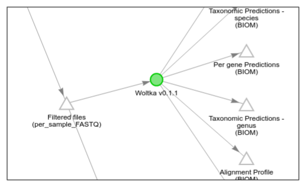
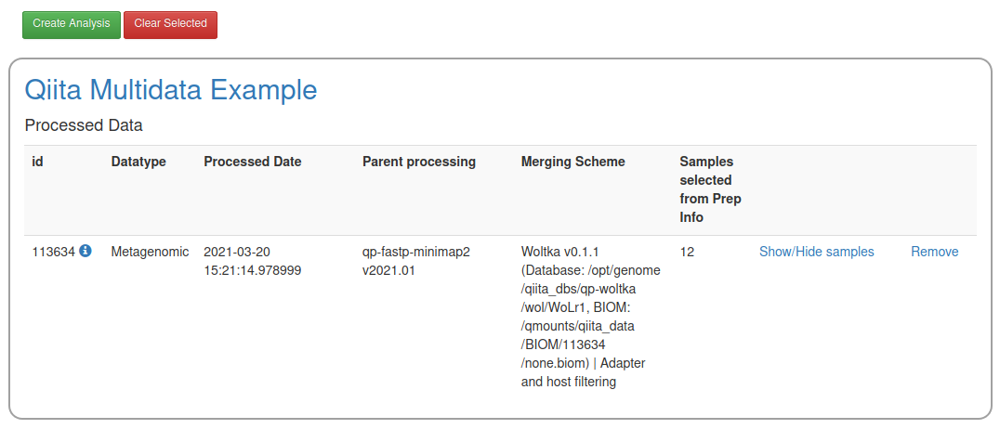
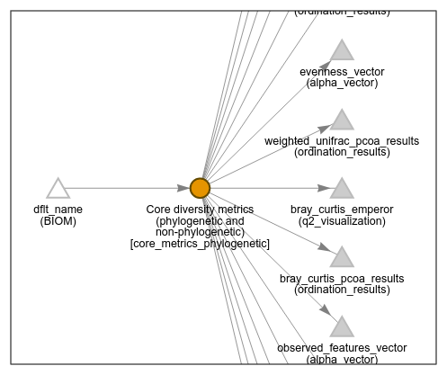

# Working with Qiita

[**Qiita**](https://qiita.ucsd.edu/) is a web platform for hosting and analyzing microbiome datasets. Woltka has been implemented in Qiita as part of the standard operating procedure for shotgun metagenomic data analysis. Please find below the instructions for using Woltka and retrieving Woltka results.

## Existing results

We have run Woltka using the [**WoL**](wol.md) and **Rep200** (NCBI RefSeq v200, representative & reference genomes) database on all shotgun metagenomic datasets hosted in Qiita. The output files (white triangles) are ready for download, as shown below:

There are more than one Woltka runs. To determine which database was used in each analysis, click the "**Woltka v0.1.1**" green circle, check the "**Database**" parameter.

The output files of each run are:

  - "**Alignment Profile**". The alignment file generated by Bowtie2. This is also the input file for Woltka, with which one can run custom analyses.
  - "**Per genome predictions**": Genome-level profile, i.e., an "OGU table".
  - "**Per gene predictions**: Gene-level profile, generated using Woltka's ordinal matching function.
  - "**Taxonomic predictions**: Taxonomic profiles at the levels of species, genus and phylum.

## New analysis

You may analyze you own shotgun metagenomic data

1. Start from host-filtered, adapter-trimmed per sample FASTQ files. Click "**Process**".
2. In "Choose command:", select "**Woltka v0.1.1**" (or the latest version).
3. In "Parameter set:", select "**wol**" or "**rep200**", which are the two aforementioned databases.
4. Click "Add Command" to kick-start the Woltka workflow.
5. When the job is completed, you will see the aforementioned output files.

## Downstream analysis

While multiple downstream analyses can be performed on the Woltka output files, we hereby demonstrate an analysis of the **OGU table** using Qiita's built-in functions.

1. Start from the "per-genome prediction" file, click "**Add to analysis**". In a few moments, it will display "Added".
2. In the navigation bar, select "**Analysis**" -> "**Create From Selected Samples**". You will see the OGU table in the list.
2. Click the green "Create Analysis" button. Enter analysis name and description.
 - You may add multiple OGU tables (e.g., those from multiple sequencing runs), and check the "**Merge samples with the same name**" box.

3. After a short while, you will see a single triangle "**dflt_name (BIOM)**" in the processing network interface. This is the OGU table. Select it. The summary of sample and feature information will be displayed in the interface below.
4. Click "**Process**". There is a big list of available commands in the "Choose command:" dropdown menu.
5. Select "**Core diversity metrics (phylogenetic and non-phylogenetic)**". This is an all-in-one QIIME 2 pipeline.
6. In "Phylogenetic tree", select "**/projects/wol/release/databases/qiime2/phylogeny.qza**". This is the WoL tree. Also specify a reasonable **sampling depth** based on the summary of feature counts (e.g., 100,000).
7. Click "Add command", then click "Run". You job will be queued.
8. Once the job is completed, you will see a number of output files. Enjoy browsing and interpreting the results!

